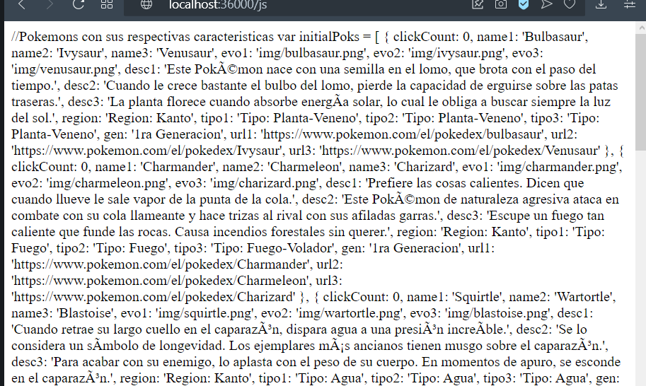

# Taller 04
### Juan Sebastian Garcia Hincapie 

## RETO 1

Para este taller los estudiantes deberán construir un servidor Web (tipo Apache) en Java. El servidor debe ser capaz de entregar páginas html e imágenes tipo PNG. Igualmente el servidor debe proveer un framework IoC para la construcción de aplicaciones web a partir de POJOS. Usando el servidor se debe construir una aplicación Web de ejemplo y desplegarlo en Heroku. El servidor debe atender múltiples solicitudes no concurrentes.

Para este taller desarrolle un prototipo mínimo que demuestre capcidades reflexivas de JAVA y permita por lo menos cargar un bean (POJO) y derivar una aplicación Web a partir de él. Debe entregar su trabajo al final del laboratorio.

### Funcionamiento: 
Pagina pincial

Archivos tipo css

Archivos tipo JPG y PNG

Archivos tipo JS

## Heroku

https://arep-lab-cuatro.herokuapp.com

## Construido con

* [Java] (https://www.oracle.com/technetwork/java/javase/downloads/jdk8-downloads-2133151.html)
* [Maven] (https://maven.apache.org/)

## Licencia

Este proyecto está licenciado bajo la Licencia MIT - vea el archivo [LICENSE.md] (LICENSE.md) para más detalles
